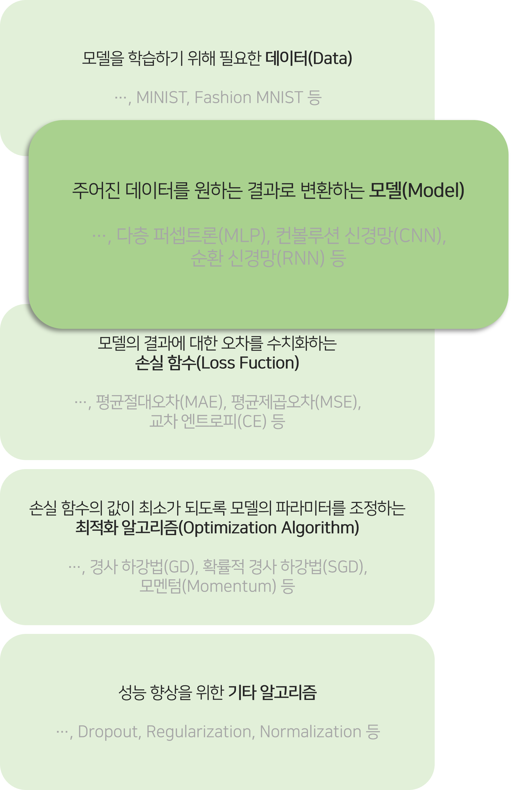
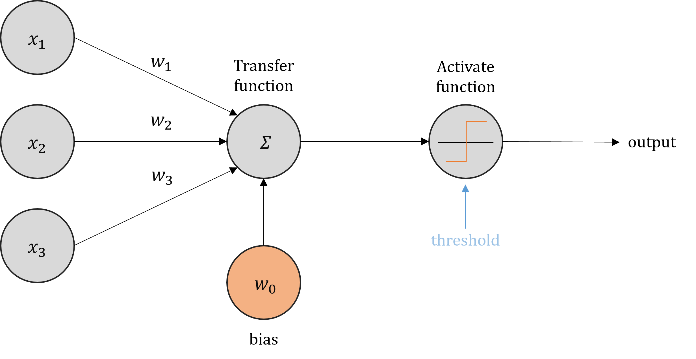
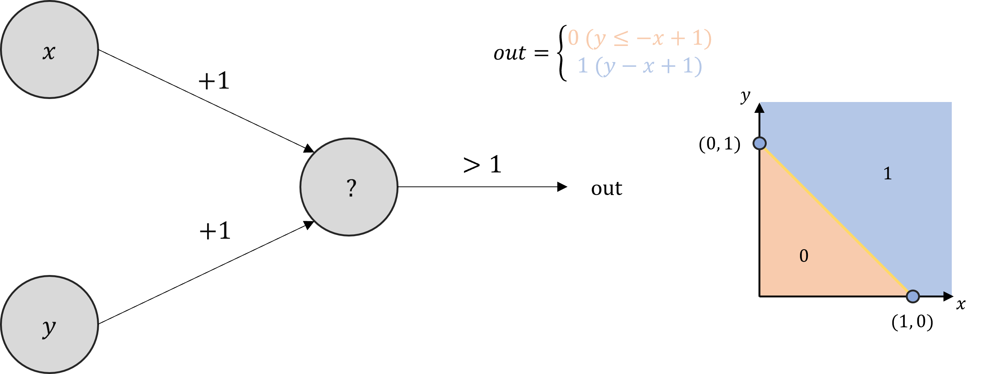
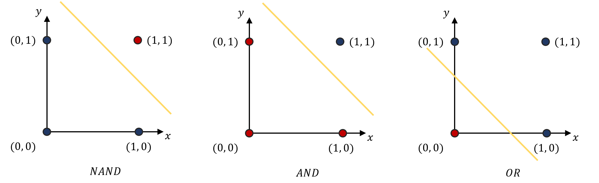
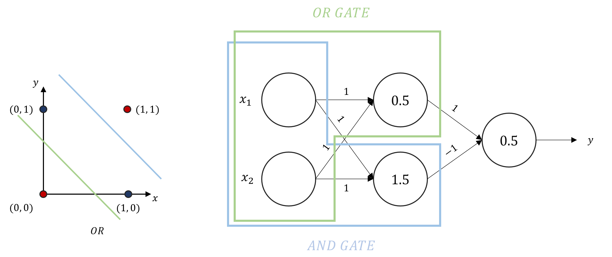
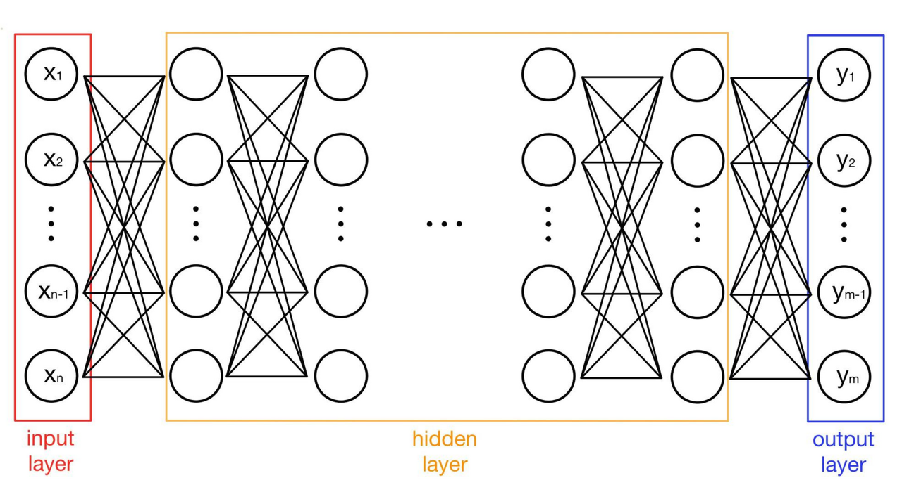
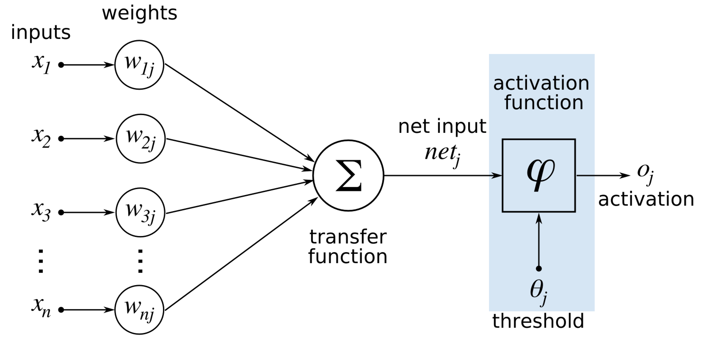

이 포스팅에서는 다층 퍼셉트론(MLP)에 대해서 다뤄볼 것이다.

### 퍼셉트론 | Perceptron
> **퍼셉트론 (Perceptron)**   
> 1957년 코넬 항공 연구소의 프랑크 로젠블라트에 의해 고안된 가장 간단한 형태의 Feed-Forward 네트워크   
> 다수의 신호를 입력받아 하나의 신호를 출력한다.   

#### 퍼셉트론의 기하학적 의미
퍼셉트론을 일반화하면 선형식을 통한 분리로 이해할 수 있다. → 선형 분리 가능성

이를 통해서 퍼셉트론 하나로 AND, OR, NAND Gate의 로직을 구현할 수 있게 되었다.

> **Universal_approximation_theorem**   
> 어떤 모델이든 NAND gate 조합으로 표현이 가능하다.   
>   
> 어떤 연산이든 perceptron으로 표현이 가능하다. → perceptron으로 구성된 NN은 어떠한 연산이든 가능하다.

 
XOR 논리 게이트는 하나의 퍼셉트론으로는 구현이 불가능함을 1969년 Minsky가 증명했다.   
그러나 여러 층의 퍼셉트론을 활용하면 분리가 가능하며, 이를 다층 퍼셉트론의 비선형 분리 가능성이라고 한다.   
즉, 퍼센트론의 조합으로 어떠한 연산이든, 어떠한 입출력 관계든지 표현이 가능하다.

### 다층 퍼셉트론 | Multi-Layer Perceptron
퍼셉트론을 사용하지 않더라도 Multiple Layer Networks가 아닌 MLP로 불리기도 한다.   
또한, Fully-Connected Layers(FCs)의 동의어로 사용된다.   
특정 뉴런은 이전 레이어의 모든 뉴런들과 연결고리가 존재한다.   

[출처](https://yhyun225.tistory.com/21)

#### 활성화 함수(Activation Function)
입력 신호의 총합을 출력신호로 변환하는 함수   

> **활성화 함수를 사용하는 이유**   
> 활성화 함수가 없는 다층 퍼셉트론은 단순한 선형식이다.   
> 활성화 함수를 통해 비선형으로 만들면 선형식으로 풀지 못하는 문제들을 풀 수 있다.   
>
>    
>
>  
> **활성화 함수의 종류**   
>
>    

